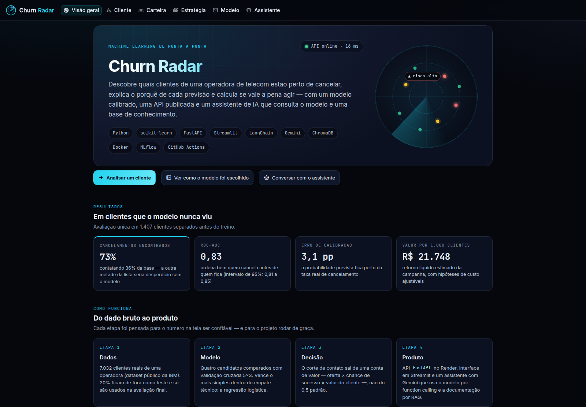

# Churn Radar (English summary)

**End-to-end customer churn prediction for a telecom company.** A calibrated model predicts who is likely to cancel, explains every prediction and computes whether a retention offer is worth it; a FastAPI service serves the model; a Streamlit app and an AI assistant (Gemini with function calling + RAG) put it in the hands of decision makers. The interface is in Brazilian Portuguese.

**Demo:** [app](https://churn-radar-br.streamlit.app) · [API docs](https://churn-radar-api.onrender.com/docs) · [API health](https://churn-radar-api.onrender.com/health)



## Results (held-out test set, 1,407 customers, 95% bootstrap CIs)

| Metric | Model | Reference |
|---|---|---|
| Average precision | **0.619** (0.566–0.673) | 0.266 (base rate) |
| ROC-AUC | **0.834** (0.812–0.855) | 0.5 |
| Calibration error (ECE) | **3.1 pp** | 11.7 pp in the first version |
| Churners reached | **73%** while contacting 36% of customers | — |

## Key decisions ([ADRs](docs/decisoes/), in Portuguese)

1. **Calibrated probabilities, value-based threshold.** No class re-weighting; the contact threshold comes from `offer cost ÷ (success rate × customer value)` instead of 0.5.
2. **Simplest model within noise.** Repeated 5×3 cross-validation with the Nadeau–Bengio corrected standard error and the one-standard-error rule: logistic regression wins (exact explanations, lightweight API).
3. **No misleading features.** Monthly charges are almost fully determined by the subscribed services (R² = 0.999) and got a negative coefficient; removing them (and total charges) cost 0.002 AP, well within noise.
4. **No cold-start spinner.** When the free-tier API is asleep, the app computes the same prediction locally (same model file, same code) and wakes the API in the background.
5. **Each service ships only what it uses.** The API runs at ~170 MB of RAM (Render free tier: 512 MB); a test blocks accidental imports of UI or agent code.

## Run locally

```bash
pip install -r requirements-dev.txt
uvicorn src.api:app --reload   # http://127.0.0.1:8000/docs
streamlit run app.py           # http://localhost:8501
pytest                         # 263 offline tests
```

Author: **Eduardo Henrique** — Data Science & AI student at CESAR School · [LinkedIn](https://www.linkedin.com/in/eduardo-henrique15/). MIT License.
