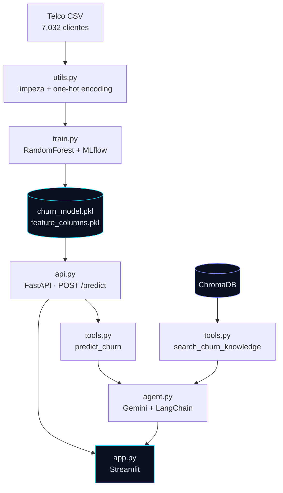

# Churn Radar

**Plataforma de previsão de cancelamento de clientes de telecom**: um modelo de Machine Learning servido por API REST, um agente de IA que interpreta o resultado com RAG e function calling, e uma interface web que une os dois.

<p>


</p>

---

## Problema de negócio

Empresas de assinatura (telecom, SaaS, streaming) precisam identificar **quais clientes estão prestes a cancelar antes que isso aconteça**, para que o time de retenção possa agir — oferta, contato proativo, ajuste de plano.

Um modelo que só devolve `0.73` não resolve esse problema sozinho: alguém ainda precisa traduzir o número em decisão. Por isso o projeto vai além da previsão e entrega **a probabilidade, os fatores por trás dela e a recomendação de ação**, num fluxo que um analista de retenção usaria de fato.

## Arquitetura



`utils.py` é a fonte única de verdade do schema: os mesmos tipos que validam o payload da API geram os campos da interface. Uma opção que o modelo nunca viu no treino não chega a produzir previsão — a API responde `422`.

## Interface

Duas abas, ambas consumindo a mesma API REST.

| Aba | O que faz |
|---|---|
| **Dashboard de Previsão** | Formulário validado, gauge de probabilidade e leitura dos fatores de risco do perfil |
| **Assistente IA** | Agente com memória de conversa, acesso ao modelo (function calling) e à base de conhecimento (RAG) |

## Resultados do modelo

| Métrica | Valor |
|---|---|
| Acurácia | 0.75 |
| Precision (classe "Churn") | 0.52 |
| Recall (classe "Churn") | **0.77** |
| F1-score | 0.62 |

**Por que recall e não acurácia.** O dataset é desbalanceado (73,4% não cancelam), então um modelo que chutasse "ninguém cancela" teria 73% de acurácia e valor de negócio zero. Mais importante: os erros têm custos assimétricos — deixar de identificar quem vai cancelar (falso negativo) custa o cliente inteiro, enquanto contatar quem não ia cancelar (falso positivo) custa uma ligação. Por isso o modelo usa `class_weight="balanced"` e é avaliado por recall, aceitando precision mais baixa de forma deliberada.

**Features mais importantes** (medidas do modelo treinado):

| Feature | Importância |
|---|---|
| `tenure` | 0.174 |
| `TotalCharges` | 0.138 |
| `MonthlyCharges` | 0.110 |
| `Contract_Two year` | 0.099 |
| `InternetService_Fiber optic` | 0.066 |

O tempo de casa domina: quem cancela tem mediana de ~10 meses, contra ~38 meses de quem permanece. O risco de churn se concentra nos primeiros meses de contrato.

## Stack

| Camada | Tecnologia |
|---|---|
| Modelagem | scikit-learn (RandomForestClassifier), Pandas |
| Experimentos | MLflow (params, métricas, signature e modelo versionado) |
| API | FastAPI + Uvicorn, validação por Pydantic |
| Interface | Streamlit (CSS próprio, SVG para gauge e radar) |
| Agente | LangChain + Gemini, function calling |
| RAG | ChromaDB + `gemini-embedding-001` |
| Container | Docker (usuário sem privilégios, healthcheck) |

## Como rodar

### Pré-requisitos
- Python 3.11+
- Chave da API do Gemini ([Google AI Studio](https://aistudio.google.com)) — só para o agente
- Docker (opcional)

### Setup

```bash
git clone https://github.com/EduardoHenrique15/churn-prediction-copilot.git
cd churn-prediction-copilot

python -m venv .venv
.venv\Scripts\activate          # Windows
# source .venv/bin/activate     # Linux/Mac

pip install -r requirements.txt

cp .env.example .env            # preencha a GEMINI_API_KEY
```

> **Todos os comandos rodam a partir da raiz do projeto.** Os módulos usam imports de pacote (`src.api`, `src.train`), então rodar de dentro de `src/` não funciona.

### 1. API de previsão

```bash
uvicorn src.api:app --reload
```

Documentação interativa em `http://127.0.0.1:8000/docs`.

### 2. Interface

```bash
streamlit run app.py
```

Abre em `http://localhost:8501`. A aba de previsão funciona só com a API; a aba do agente também precisa da `GEMINI_API_KEY` e da base vetorial (passo 4).

### 3. Via Docker (alternativa ao passo 1)

```bash
docker build -t churn-api .
docker run -p 8000:8000 churn-api
```

### 4. Base de conhecimento do agente (RAG)

```bash
python -m src.build_knowledge_base
```

### 5. Agente pelo terminal

```bash
python -m src.chat_test
```

### 6. Retreinar o modelo

O treino precisa do CSV bruto em `data/raw/` ([Telco Customer Churn no Kaggle](https://www.kaggle.com/datasets/blastchar/telco-customer-churn)) e das dependências de desenvolvimento:

```bash
pip install -r requirements-dev.txt
python -m src.train

mlflow ui --backend-store-uri sqlite:///mlflow.db   # experimentos em localhost:5000
```

## Variáveis de ambiente

| Variável | Default | Para quê |
|---|---|---|
| `GEMINI_API_KEY` | — | Obrigatória para o agente e para indexar o RAG |
| `GEMINI_CHAT_MODEL` | `gemini-3.6-flash` | Modelo de conversa |
| `GEMINI_EMBEDDING_MODEL` | `models/gemini-embedding-001` | Modelo de embeddings do RAG |
| `CHURN_API_URL` | `http://127.0.0.1:8000` | URL da API consumida pela interface e pelo agente |
| `CHURN_API_TIMEOUT` | `60` | Timeout em segundos das chamadas à API |

## API

**`POST /predict`**

```json
{
  "gender": "Female",
  "SeniorCitizen": 0,
  "Partner": "Yes",
  "Dependents": "No",
  "tenure": 5,
  "PhoneService": "Yes",
  "MultipleLines": "No",
  "InternetService": "Fiber optic",
  "OnlineSecurity": "No",
  "OnlineBackup": "No",
  "DeviceProtection": "No",
  "TechSupport": "No",
  "StreamingTV": "Yes",
  "StreamingMovies": "Yes",
  "Contract": "Month-to-month",
  "PaperlessBilling": "Yes",
  "PaymentMethod": "Electronic check",
  "MonthlyCharges": 85.5,
  "TotalCharges": 450.75
}
```

```json
{
  "churn_prediction": false,
  "churn_probability": 0.4731,
  "risk_level": "Médio"
}
```

Campos categóricos aceitam apenas os valores presentes no dataset de treino. `"gender": "Banana"` devolve **422**, não uma previsão.

**`GET /health`** — usado pelo healthcheck do container e pela interface para detectar hibernação do serviço.

## Decisões técnicas

**Um único pré-processamento para treino e inferência.** `preprocess_features` e `align_columns` vivem em `utils.py` e são chamadas nos dois caminhos. Uma requisição individual gera só as dummies das categorias presentes nela; `align_columns` reindexa para as 30 colunas do treino preenchendo o resto com 0. Sem isso, a ordem e o conjunto de colunas divergiriam silenciosamente entre treino e produção — o modelo não erraria, ele daria a resposta errada com confiança.

**Validação no tipo, não no `if`.** Os campos categóricos são `Literal` do Pydantic. Isso rejeita entrada inválida com 422 antes de chegar ao modelo, documenta os valores aceitos automaticamente no `/docs`, e — via `typing.get_args` — alimenta os selects da interface. Um único lugar para mudar quando o schema mudar.

**Coerção numérica antes do `dropna`.** `TotalCharges` vem do CSV como texto e usa string vazia para os 11 valores faltantes, não `NaN`. Se o `dropna` rodar antes da conversão, ele não encontra nulo nenhum e as linhas problemáticas entram no treino sem erro. A ordem em `load_raw_data` é proposital e o número de linhas descartadas é impresso no log.

**Faixas de risco em vez de binário.** Um time de retenção age diferente em 0.38 e em 0.91, e o threshold de 0.5 do classificador não distingue os dois. A API devolve `Baixo` / `Médio` / `Alto` com cortes explícitos em 0.35 e 0.65.

**Agente com histórico explícito.** `chat()` recebe e devolve a lista de mensagens em vez de guardar estado global. A interface mantém o histórico em `session_state`, o que permite perguntas de acompanhamento ("e o que eu faço com esse cliente?") e mantém a função testável. O laço de function calling tem teto de iterações para não queimar quota num modelo que insista em chamar ferramenta.

**MLflow com signature e input example.** Além de params e métricas, o modelo é registrado com a assinatura inferida, o que torna o artefato autodescritivo sobre o formato de entrada que ele espera.

**Interface sem framework de componentes.** Gauge e radar são SVG escritos à mão em vez de biblioteca de gráficos: o controle sobre a animação e a paleta é total e não entra dependência nova. Todo HTML dinâmico passa por um helper que normaliza a indentação, porque o `st.markdown` do Streamlit roda o Markdown antes do HTML e linhas indentadas viram bloco de código.

**Rótulos em português, valores em inglês.** Os selects exibem "Fibra óptica" e "Mensal", mas enviam `"Fiber optic"` e `"Month-to-month"` para a API — a tradução vive num `format_func`, nunca no valor. O modelo foi treinado com essas categorias exatas; traduzir o que é enviado quebraria o one-hot encoding e produziria previsão errada sem erro nenhum.

**O tema depende de `.streamlit/config.toml`.** Os widgets (select, slider, number input) são renderizados pelo Streamlit e ignoram o CSS da página — no 1.63 esses elementos nem expõem `data-testid`, apenas classes `st-emotion-cache-*` geradas por build. Então o tema escuro vem do `config.toml`, que é a via suportada; o CSS da página cuida do resto e fixa a cor dos rótulos para que a interface continue legível mesmo se o config não for carregado.

## Deploy

A API e a interface são publicadas separadamente, o que mantém a API REST como um serviço de verdade em vez de código morto atrás da UI.

1. **API no Render** — `render.yaml` já está no repositório: o serviço builda pelo `Dockerfile` e expõe o healthcheck em `/health`. O `Dockerfile` escuta na `$PORT` injetada pela plataforma.
2. **Interface no Streamlit Cloud** — aponte para `app.py` e configure os secrets:

```toml
CHURN_API_URL = "https://sua-api.onrender.com"
GEMINI_API_KEY = "sua-chave"
```

> No free tier o Render hiberna o serviço; a primeira requisição depois disso acorda o container e pode levar quase um minuto. A interface trata isso com timeout estendido e skeleton loading em vez de erro.

## Estrutura

```
churn-prediction-copilot/
├── app.py                       # interface Streamlit (2 abas)
├── src/
│   ├── utils.py                 # schema + pré-processamento compartilhados
│   ├── train.py                 # treino + tracking no MLflow
│   ├── api.py                   # API FastAPI
│   ├── agent.py                 # agente conversacional
│   ├── tools.py                 # ferramentas do agente (previsão + RAG)
│   ├── build_knowledge_base.py  # indexação no ChromaDB
│   └── chat_test.py             # agente via terminal
├── data/
│   ├── raw/                     # dataset original (não versionado)
│   ├── knowledge_base/          # documentos do RAG
│   └── processed_churn.csv
├── models/                      # modelo, colunas e métricas do último treino
├── notebooks/01_eda.ipynb       # análise exploratória
├── Dockerfile
├── render.yaml
├── .streamlit/config.toml       # tema escuro da interface
├── .env.example
├── requirements.txt             # runtime (API + agente + interface)
└── requirements-dev.txt         # treino e análise
```

## Roadmap

- [x] Modelo de churn com tracking de experimentos (MLflow)
- [x] API REST com validação de schema e containerização
- [x] Agente de IA com RAG e function calling
- [x] Interface visual unindo previsão e agente
- [ ] Explicabilidade por previsão com SHAP — hoje a interface mostra leitura de perfil baseada na importância global das features, não atribuição por caso
- [ ] Testes automatizados (pytest) cobrindo pré-processamento e contrato da API
- [ ] Deploy público (API no Render + interface no Streamlit Cloud)

## Autor

**Eduardo Henrique** — Estudante de Ciência de Dados e IA na CESAR School
[LinkedIn](https://www.linkedin.com/in/eduardo-henrique15/)