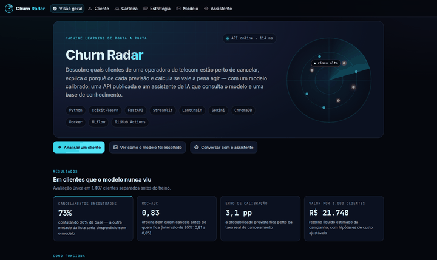
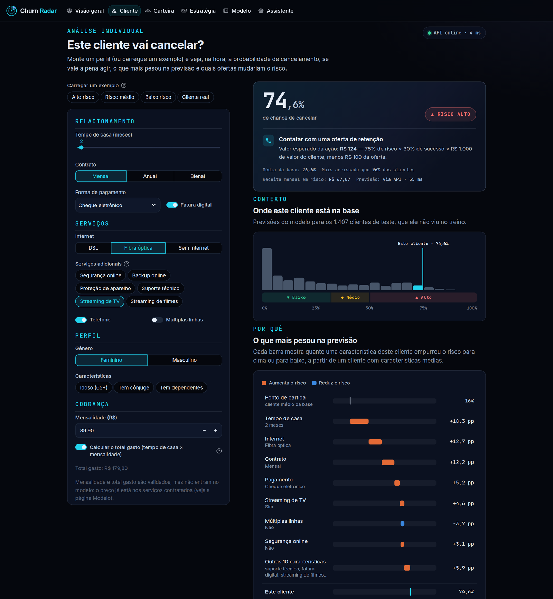
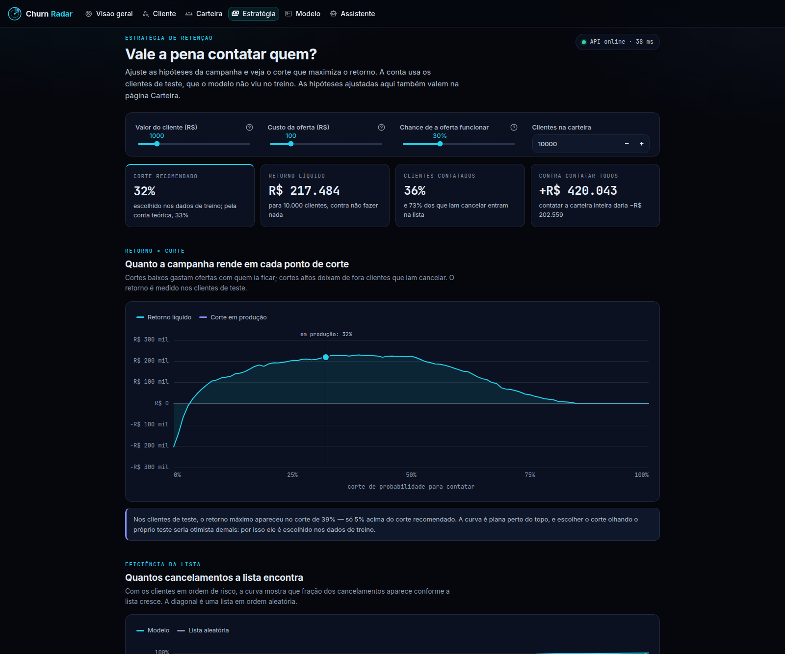
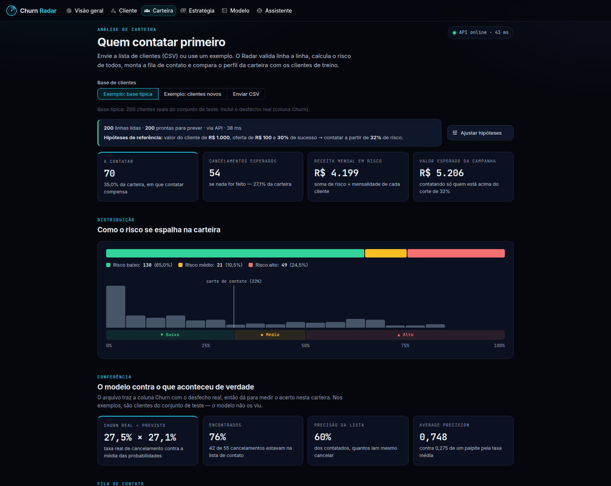
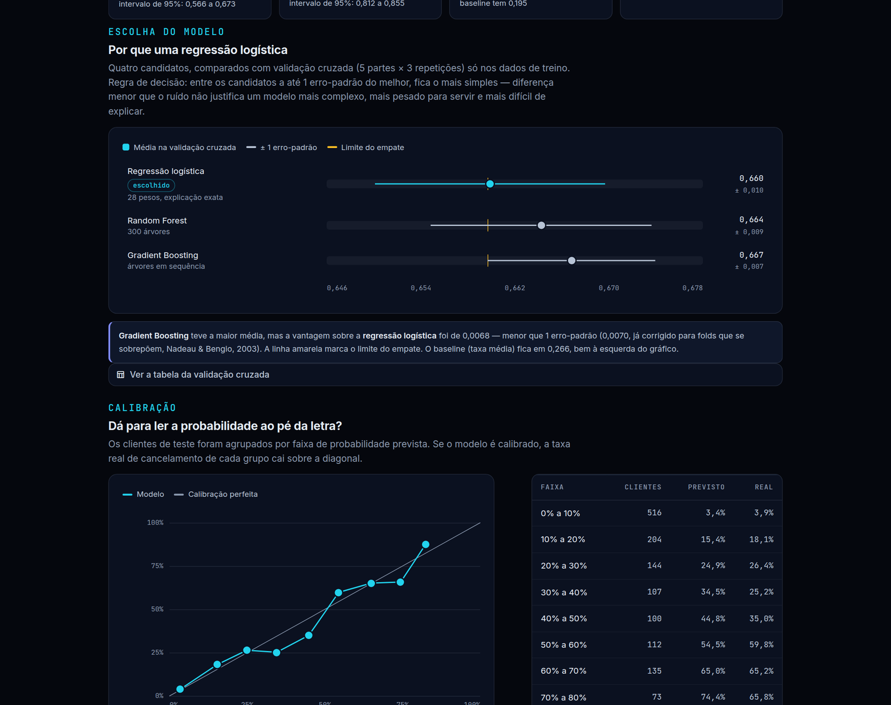
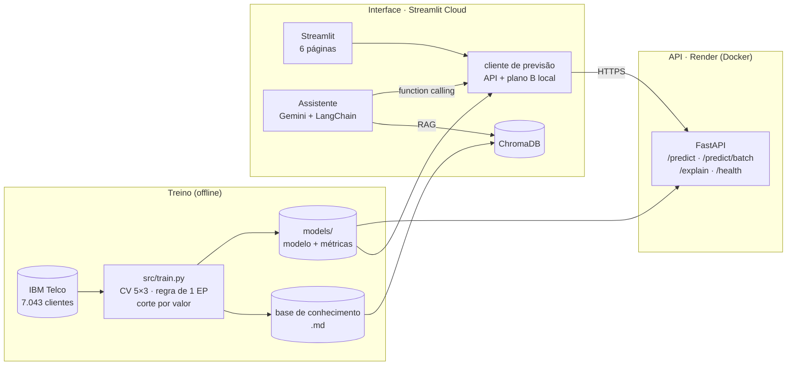

# Churn Radar

**Previsão de cancelamento de clientes de telecom — do dado bruto ao produto.** Um modelo calibrado diz quem vai cancelar, explica o porquê de cada previsão e calcula se vale a pena agir; uma API publica o modelo; uma interface web e um assistente de IA (function calling + RAG) colocam tudo nas mãos de quem decide.

<p>
<a href="https://github.com/EduardoHenrique15/churn-prediction-copilot/actions/workflows/ci.yml"></a>


</p>

**Demonstração:** [interface](https://churn-prediction-copilot-7vmqckjqy8fpqth4vctvtk.streamlit.app) · [documentação da API](https://churn-radar-api.onrender.com/docs) · [status da API](https://churn-radar-api.onrender.com/health)



---

## O problema

Empresas de assinatura precisam saber **quem vai cancelar antes que cancele**, para que a equipe de retenção aja a tempo. Mas uma probabilidade solta não resolve: alguém ainda precisa decidir se vale gastar uma oferta com aquele cliente. O Churn Radar entrega a probabilidade, o motivo, a decisão e quanto ela vale.

## Resultados

Avaliação única em **1.407 clientes** separados antes do treino (intervalos de 95% por bootstrap):

| Métrica | Modelo | Referência |
|---|---|---|
| Average precision | **0,619** (0,566 a 0,673) | 0,266 — palpite pela taxa média |
| ROC-AUC | **0,834** (0,812 a 0,855) | 0,5 — aleatório |
| Erro de calibração (ECE) | **3,1 pp** | 11,7 pp na versão anterior |
| Cancelamentos encontrados | **73%**, contatando 36% da base | — |
| Valor líquido da campanha | **R$ 21,7 mil por 1.000 clientes** | −R$ 20,3 mil contatando todos |

As hipóteses de custo (valor do cliente R$ 1.000, oferta R$ 100, 30% de sucesso) são ilustrativas e ajustáveis ao vivo na interface.

## O que dá para fazer

| Página | O que faz |
|---|---|
| **Cliente** | Monte um perfil (ou sorteie um cliente real do teste, com o desfecho verdadeiro) e veja risco, recomendação com valor esperado, a contribuição de cada característica e ofertas que mudariam o risco |
| **Carteira** | Envie um CSV: validação linha a linha, fila de contato, conferência com o desfecho real e monitor de mudança no perfil da base (PSI) |
| **Estratégia** | Mude o valor do cliente, o custo da oferta e a chance de sucesso; o corte recomendado e o retorno da campanha se recalculam |
| **Modelo** | Model card: escolha do modelo, calibração, o que o modelo aprendeu, desempenho por grupo, usos e limites |
| **Assistente** | Chat em português com Gemini: consulta o modelo por function calling e a documentação por RAG, mostrando as ferramentas usadas |

<p>


</p>
<p>


</p>

## Decisões que fazem diferença

Cada uma tem um registro com contexto, evidência e consequências em [`docs/decisoes/`](docs/decisoes/).

1. **Probabilidades calibradas, corte por valor.** Sem reponderação de classes (que inflava o risco médio de 27% para 38%), e o corte de contato sai de `custo ÷ (sucesso × valor do cliente)`, não do 0,5 padrão. → [001](docs/decisoes/001-probabilidades-calibradas.md)
2. **O modelo mais simples dentro do ruído.** Validação cruzada 5 × 3 com erro-padrão corrigido (Nadeau & Bengio): o Gradient Boosting ganhou por 0,007 de average precision, abaixo de 1 erro-padrão. Vence a regressão logística — explicação exata e API leve. → [002](docs/decisoes/002-regra-de-1-erro-padrao.md)
3. **Variáveis que não enganam.** A mensalidade é determinada pelos serviços (R² = 0,999) e aparecia com peso negativo. Fora do modelo, os pesos voltam a ter leitura de negócio, sem perda mensurável. → [003](docs/decisoes/003-variaveis-de-cobranca.md)
4. **Sem tela de espera.** A API gratuita hiberna; a interface calcula a mesma previsão localmente enquanto ela acorda — e diz de onde veio o número. → [004](docs/decisoes/004-plano-b-local.md)
5. **Cada serviço com só o que usa.** A API sobe com ~170 MB de RAM (limite de 512 MB no Render); um teste impede que ela passe a importar a interface ou o agente. → [005](docs/decisoes/005-dependencias-separadas.md)

Também: correção de um bug de *train/serve skew* da primeira versão (um cliente sozinho perdia todas as categorias no one-hot e virava o cliente de referência), validação de combinações impossíveis (sem internet, mas com suporte técnico → 422) e base de conhecimento do assistente regenerada a cada treino.

## Arquitetura


```mermaid
flowchart LR
    subgraph treino["Treino (offline)"]
        D[("IBM Telco<br/>7.043 clientes")] --> T["src/train.py<br/>CV 5×3 · regra de 1 EP<br/>corte por valor"]
        T --> M[("models/<br/>modelo + métricas")]
        T --> K[("base de conhecimento<br/>.md")]
    end
    subgraph render["API · Render (Docker)"]
        A["FastAPI<br/>/predict · /predict/batch<br/>/explain · /health"]
    end
    subgraph cloud["Interface · Streamlit Cloud"]
        U["Streamlit<br/>6 páginas"] --> C["cliente de previsão<br/>API + plano B local"]
        G["Assistente<br/>Gemini + LangChain"] -->|function calling| C
        G -->|RAG| V[("ChromaDB")]
    end
    M --> A
    M --> C
    K --> V
    C -->|HTTPS| A
```

- `src/schema.py` e `src/predictor.py` são o núcleo compartilhado: validação, encoding e decisão são o mesmo código na API, na interface e no agente.
- Treino rastreado com MLflow; CI no GitHub Actions (lint, 263 testes com cobertura e build da imagem da API com medição de memória).

## Como rodar

**Pré-requisito:** baixe `WA_Fn-UseC_-Telco-Customer-Churn.csv` do [Kaggle](https://www.kaggle.com/datasets/blastchar/telco-customer-churn) para `data/raw/` (só para treinar; os artefatos do modelo já estão no repositório).

```bash
python -m venv .venv
source .venv/bin/activate            # Windows: .venv\Scripts\activate
pip install -r requirements-dev.txt

python -m src.train                  # opcional: retreina e regenera o model card
uvicorn src.api:app --reload         # terminal 1 → http://127.0.0.1:8000/docs
streamlit run app.py                 # terminal 2 → http://localhost:8501
```

Com Docker: `docker compose up --build` sobe API e interface juntas.

O assistente precisa de uma chave gratuita do Google AI Studio em `GEMINI_API_KEY` (copie `.env.example` para `.env`). Sem chave, ele mostra as respostas gravadas e todo o resto funciona.

## API

| Método | Rota | O que faz |
|---|---|---|
| `GET` | `/health` | estado, versão, modelo e corte em uso |
| `POST` | `/predict` | probabilidade, decisão de contato e faixa de risco de um cliente |
| `POST` | `/predict/batch` | o mesmo para até 1.000 clientes numa chamada |
| `POST` | `/explain` | contribuição de cada variável (soma exatamente a previsão) |

```bash
curl -X POST http://127.0.0.1:8000/predict -H "Content-Type: application/json" -d '{
  "gender": "Female", "SeniorCitizen": 0, "Partner": "Yes", "Dependents": "No",
  "tenure": 5, "PhoneService": "Yes", "MultipleLines": "No",
  "InternetService": "Fiber optic", "OnlineSecurity": "No", "OnlineBackup": "No",
  "DeviceProtection": "No", "TechSupport": "No", "StreamingTV": "Yes",
  "StreamingMovies": "Yes", "Contract": "Month-to-month", "PaperlessBilling": "Yes",
  "PaymentMethod": "Electronic check", "MonthlyCharges": 85.5, "TotalCharges": 450.75
}'
# {"churn_prediction": true, "churn_probability": 0.7733, "risk_level": "Alto"}
```

Valores fora do domínio ou combinações impossíveis voltam com **422** e a explicação em português. Há limite de requisições por IP (429) e cada resposta traz o tempo de processamento no cabeçalho `X-Response-Time-ms`.

## Qualidade

```bash
ruff check . && ruff format --check .
pytest                       # 263 testes, menos de 30 s, sem rede e sem gastar cota
pytest -m integration        # eval do agente contra o Gemini real (6 requisições)
```

Os testes cobrem o contrato da API (incluindo as regressões do bug de encoding), métricas e seleção do treino, explicações (aditividade exata), cliente com plano B, validação do CSV, agente com um modelo de linguagem falso, a interface inteira com o `AppTest` do Streamlit e guardas de empacotamento.

## Estrutura

```
app.py                  interface (Streamlit): moldura, navegação e rodapé
src/
  train.py              treino: CV, seleção, corte, avaliação, artefatos
  api.py                API (FastAPI)
  schema.py             contrato de dados (Pydantic), compartilhado
  predictor.py          modelo + decisão, compartilhado
  client.py             cliente da API com plano B local
  business.py           valor, corte, faixas de risco, cenários, PSI
  explain.py            explicação exata (linear) ou SHAP (árvores)
  agent.py · tools.py   assistente: loop de ferramentas em streaming
  knowledge.py          documentos da base de conhecimento gerados pelo treino
  ui/                   páginas, gráficos em HTML/SVG, tema e componentes
models/                 modelo, métricas, curvas e perfil de referência
data/                   exemplos para a interface e base de conhecimento
docs/                   decisões (ADRs), deploy e imagens
notebooks/01_eda.ipynb  análise exploratória
tests/                  263 testes
```

## Limitações

- Dataset público (IBM Telco, 7.043 clientes de uma operadora dos EUA): um retrato de um único momento, não uma operação real.
- O modelo aprende associações, não causas; as simulações indicam o que testar, não o resultado garantido.
- Em clientes com contrato de dois anos o churn é raro (2,4%) e o modelo quase nunca recomenda contato nesse grupo.
- Os custos da campanha são hipóteses de referência.

## Autor

**Eduardo Henrique** — estudante de Ciência de Dados e IA na CESAR School · [LinkedIn](https://www.linkedin.com/in/eduardo-henrique15/)

Licença MIT. English summary: [README.en.md](README.en.md).
